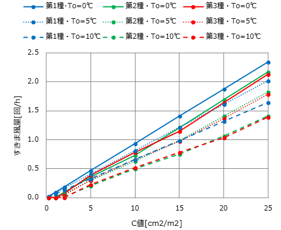

.. include:: definition.txt

.. raw:: latex

    \clearpage

========================================================================================================================
建物全般
========================================================================================================================

------------------------------------------------------------------------------------------------------------------------
1 はじめに
------------------------------------------------------------------------------------------------------------------------

本節では、「建物全般」の計算方法の根拠を記す。

------------------------------------------------------------------------------------------------------------------------
2 記号及び添え字
------------------------------------------------------------------------------------------------------------------------

^^^^^^^^^^^^^^^^^^^^^^^^^^^^^^^^^^^^^^^^^^^^^^^^^^^^^^^^^^^^^^^^^^^^^^^^^^^^^^^^^^^^^^^^^^^^^^^^^^^^^^^^^^^^^^^^^^^^^^^^
2.1 記号
^^^^^^^^^^^^^^^^^^^^^^^^^^^^^^^^^^^^^^^^^^^^^^^^^^^^^^^^^^^^^^^^^^^^^^^^^^^^^^^^^^^^^^^^^^^^^^^^^^^^^^^^^^^^^^^^^^^^^^^^

この計算で用いる記号及び単位を次に示す。

.. list-table:: 表1 記号及び単位
    :header-rows: 1
    :widths: 1,6,1

    * - 記号
      - 意味
      - 単位
    * - :math:`C`
      - C value / 相当隙間面積（C値）
      - |cm2| / |m2|
    * - :math:`g`
      - gravity acceleration / 重力加速度
      - m / |s2|
    * - :math:`h`
      - height from inside floor level / 室内床面からの高さ
      - m
    * - :math:`h`
      - height from inside floor level at gap :math:`g` / すきま :math:`g` の室内床面からの高さ
      - m
    * - :math:`H`
      - height at ceiling level / 天井レベルの高さ
      - m
    * - :math:`I`
      - infiltration leakage air rate / すきま風流入回数
      - 1 / h
    * - :math:`P_0`
      - pressure difference of inside to outside at floor level / 床面の外気に対する室内の圧力差
      - Pa
    * - :math:`Q_g`
      - leakage air volume at gap :math:`g` / すきま :math:`g` のすきま風量
      - |m3| / s
    * - :math:`Q_V`
      - ventilation amount / 換気風量
      - |m3| / s
    * - :math:`U_A`
      - U\ :sub:`A` \ value / U\ :sub:`A` \ 値
      - W / ( |m2| K)
    * - :math:`V`
      - air volume / 風量
      - |m3| / h
    * - :math:`\alpha A`
      - equivalent gap area / 相当隙間面積
      - |m2|
    * - :math:`\alpha A_g`
      - equivalent gap area at gap :math:`g` / すきま :math:`g` の相当隙間面積
      - |m2|
    * - :math:`\Delta P(h)`
      - pressure difference between inside and outside at the height from inside floor level :math:`h` / 室内床面からの高さ :math:`h` における室内外圧力差
      - Pa
    * - :math:`\Delta T`
      - temperature difference between inside and outside / 室内外温度差
      - K
    * - :math:`\rho`
      - air density / 空気の密度
      - kg / |m3|
    * - :math:`\rho_i`
      - inside air density / 室内の空気の密度
      - kg / |m3|
    * - :math:`\rho_o`
      - outside air density / 室外の空気の密度
      - kg / |m3|
    * - :math:`\theta`
      - temperature / 温度
      - ℃

^^^^^^^^^^^^^^^^^^^^^^^^^^^^^^^^^^^^^^^^^^^^^^^^^^^^^^^^^^^^^^^^^^^^^^^^^^^^^^^^^^^^^^^^^^^^^^^^^^^^^^^^^^^^^^^^^^^^^^^^
2.2 添え字
^^^^^^^^^^^^^^^^^^^^^^^^^^^^^^^^^^^^^^^^^^^^^^^^^^^^^^^^^^^^^^^^^^^^^^^^^^^^^^^^^^^^^^^^^^^^^^^^^^^^^^^^^^^^^^^^^^^^^^^^

この計算で用いる添え字を次に示す。

.. list-table:: 表2 添え字
    :header-rows: 1
    :widths: 1,7

    * - 添え字
      - 意味
    * - :math:`g`
      - すきま

------------------------------------------------------------------------------------------------------------------------
3 C値の推定
------------------------------------------------------------------------------------------------------------------------

^^^^^^^^^^^^^^^^^^^^^^^^^^^^^^^^^^^^^^^^^^^^^^^^^^^^^^^^^^^^^^^^^^^^^^^^^^^^^^^^^^^^^^^^^^^^^^^^^^^^^^^^^^^^^^^^^^^^^^^^
3.1 はじめに
^^^^^^^^^^^^^^^^^^^^^^^^^^^^^^^^^^^^^^^^^^^^^^^^^^^^^^^^^^^^^^^^^^^^^^^^^^^^^^^^^^^^^^^^^^^^^^^^^^^^^^^^^^^^^^^^^^^^^^^^

2002年から2004年にかけて、日本全国80戸の戸建住宅、集合住宅を対象に詳細なエネルギー消費の実態調査が行われた。
当該対象住戸は熱損失係数Q値とすきま総面積C値が求められている。
ここでは、Q値から推定した外皮平均熱貫流率 U\ :sub:`A` \ 値とC値の関係を把握し、熱負荷計算プログラムにおいて断熱性能からすきま風量を求めるための基礎データとすることを目的とする。

^^^^^^^^^^^^^^^^^^^^^^^^^^^^^^^^^^^^^^^^^^^^^^^^^^^^^^^^^^^^^^^^^^^^^^^^^^^^^^^^^^^^^^^^^^^^^^^^^^^^^^^^^^^^^^^^^^^^^^^^
3.2 対象とするデータの出展
^^^^^^^^^^^^^^^^^^^^^^^^^^^^^^^^^^^^^^^^^^^^^^^^^^^^^^^^^^^^^^^^^^^^^^^^^^^^^^^^^^^^^^^^^^^^^^^^^^^^^^^^^^^^^^^^^^^^^^^^

採用する住戸ごとの断熱性能、気密性能は建築学会で公開されているデータ\ :sup:`(1)` \である。

^^^^^^^^^^^^^^^^^^^^^^^^^^^^^^^^^^^^^^^^^^^^^^^^^^^^^^^^^^^^^^^^^^^^^^^^^^^^^^^^^^^^^^^^^^^^^^^^^^^^^^^^^^^^^^^^^^^^^^^^
3.3 Q値からU\ :sub:`A` \ 値の推定法
^^^^^^^^^^^^^^^^^^^^^^^^^^^^^^^^^^^^^^^^^^^^^^^^^^^^^^^^^^^^^^^^^^^^^^^^^^^^^^^^^^^^^^^^^^^^^^^^^^^^^^^^^^^^^^^^^^^^^^^^

住宅性能表示精度における等級4レベルのQ値基準とUA値基準の関係より推定した。

図1 Q値とU\ :sub:`A` \ 値との関係

^^^^^^^^^^^^^^^^^^^^^^^^^^^^^^^^^^^^^^^^^^^^^^^^^^^^^^^^^^^^^^^^^^^^^^^^^^^^^^^^^^^^^^^^^^^^^^^^^^^^^^^^^^^^^^^^^^^^^^^^
3.4 U\ :sub:`A` \ 値とC値
^^^^^^^^^^^^^^^^^^^^^^^^^^^^^^^^^^^^^^^^^^^^^^^^^^^^^^^^^^^^^^^^^^^^^^^^^^^^^^^^^^^^^^^^^^^^^^^^^^^^^^^^^^^^^^^^^^^^^^^^

書籍に掲載されている80戸のU\ :sub:`A` \ 値とC値の関係を地域・建て方および構造・工法別に整理して図2、図3に示す。
「関西・戸建」のC値が高めであることがわかる。
しかしながら、地域別や建て方別については、U\ :sub:`A` \ 値とC値の関連はそれほど強くはないのが確認できる。
一方で、構造別についてみるとRC造・SRC造とそれ以外で大まかな区分が期待できる。

図2 地域・建て方別のU\ :sub:`A` \ 値とC値の関係

図3 構造・工法別のU\ :sub:`A` \ 値とC値の関係

^^^^^^^^^^^^^^^^^^^^^^^^^^^^^^^^^^^^^^^^^^^^^^^^^^^^^^^^^^^^^^^^^^^^^^^^^^^^^^^^^^^^^^^^^^^^^^^^^^^^^^^^^^^^^^^^^^^^^^^^
3.5 C値の推定モデル
^^^^^^^^^^^^^^^^^^^^^^^^^^^^^^^^^^^^^^^^^^^^^^^^^^^^^^^^^^^^^^^^^^^^^^^^^^^^^^^^^^^^^^^^^^^^^^^^^^^^^^^^^^^^^^^^^^^^^^^^

図3をベースに、気密性能が高くなるRC・SRC造とそれ以外に分類し、U\ :sub:`A` \ 値とC値の関係で整理した（図4）。
両者の関係は強くないが、原点通過の線形回帰式から標準偏差分傾きを強くした同図実線をそれぞれの構造・工法のU\ :sub:`A` \ 値とC値の関係として用いる方法を提案する。
具体的な手順を下記する。

RC造・SRC造と木造在来・S造・木造パネルごとに、最小二乗法を用いて式(1)の回帰係数 :math:`a` を求める。

.. math::
    :nowrap:

    \begin{align*}
        C = a \cdot U_A
        \tag{1}
    \end{align*}

.. list-table:: 表3 係数 :math:`a` の基本統計
    :header-rows: 1
    :widths: 2,1,1,1

    * - 建て方
      - n 数
      - 平均値
      - 標準偏差
    * - RC造・SRC造
      - 26
      - 2.60
      - 1.58
    * - 木造在来・S造・木造パネル
      - 41
      - 4.46
      - 3.88

図4 構造・工法別のU\ :sub:`A` \ 値とC値の関係

計算方法で採用する係数 :math:`a` として、C値が大きめにでるような安全側の値として、平均値に標準偏差を足した値を採用する。

つまり、

- RC・SRC造：4.16
- 木造在来・S造・木造パネル：8.28

とする。

------------------------------------------------------------------------------------------------------------------------
4 すきま風量の推定方法
------------------------------------------------------------------------------------------------------------------------

^^^^^^^^^^^^^^^^^^^^^^^^^^^^^^^^^^^^^^^^^^^^^^^^^^^^^^^^^^^^^^^^^^^^^^^^^^^^^^^^^^^^^^^^^^^^^^^^^^^^^^^^^^^^^^^^^^^^^^^^
4.1 はじめに
^^^^^^^^^^^^^^^^^^^^^^^^^^^^^^^^^^^^^^^^^^^^^^^^^^^^^^^^^^^^^^^^^^^^^^^^^^^^^^^^^^^^^^^^^^^^^^^^^^^^^^^^^^^^^^^^^^^^^^^^

換気方式、気密性能に応じた時々刻々のすきま風量の計算方法について示す。

この計算方法は以下の前提をおく。

* すきま風量は温度差換気だけを考慮する（風向風速が気象データ地点と建設地で異なること、風圧係数設定のための建て込み具合の入力ができないため）
* 計画換気のファンのP-Q特性は考慮しない

^^^^^^^^^^^^^^^^^^^^^^^^^^^^^^^^^^^^^^^^^^^^^^^^^^^^^^^^^^^^^^^^^^^^^^^^^^^^^^^^^^^^^^^^^^^^^^^^^^^^^^^^^^^^^^^^^^^^^^^^
4.2 すきま風量の計算手順
^^^^^^^^^^^^^^^^^^^^^^^^^^^^^^^^^^^^^^^^^^^^^^^^^^^^^^^^^^^^^^^^^^^^^^^^^^^^^^^^^^^^^^^^^^^^^^^^^^^^^^^^^^^^^^^^^^^^^^^^

すきま風量はすきまの特性、および、すきまの高さ方向の位置で決まる室内外圧力差に応じて決定される。

換気風量およびすきま風量の合計値はゼロ、つまりバランスしなければならない。

換気風量およびすきま風量の合計値がゼロになるように、床面の外気に対する室内の圧力差 :math:`P_0` を決定する。

床面の外気に対する室内の圧力差 :math:`P_0` に応じて、換気風量およびすきま風量が決まるが、換気風量およびすきま風量がバランスするような床面の外気に対する室内の圧力差 :math:`P_0` を直接解くことはできないので、
床面の外気に対する室内の圧力差 :math:`P_0` を未知数とする収束計算を行う。

^^^^^^^^^^^^^^^^^^^^^^^^^^^^^^^^^^^^^^^^^^^^^^^^^^^^^^^^^^^^^^^^^^^^^^^^^^^^^^^^^^^^^^^^^^^^^^^^^^^^^^^^^^^^^^^^^^^^^^^^
4.3 任意の高さの室内外圧力差
^^^^^^^^^^^^^^^^^^^^^^^^^^^^^^^^^^^^^^^^^^^^^^^^^^^^^^^^^^^^^^^^^^^^^^^^^^^^^^^^^^^^^^^^^^^^^^^^^^^^^^^^^^^^^^^^^^^^^^^^

室内床面からの高さ :math:`h` における室内外圧力差 :math:`\Delta P(h)` は次式で表される。

.. math::
    :nowrap:

    \begin{align*}
        \Delta P(h) = P_0 - g \cdot h \cdot ( \rho_o - \rho_i )
        \tag{2}
    \end{align*}

温度 :math:`\theta` における密度 :math:`\rho` は次式で表される。

.. math::
    :nowrap:

    \begin{align*}
        \rho = \frac{353.25}{\theta + 273.15}
        \tag{3}
    \end{align*}

^^^^^^^^^^^^^^^^^^^^^^^^^^^^^^^^^^^^^^^^^^^^^^^^^^^^^^^^^^^^^^^^^^^^^^^^^^^^^^^^^^^^^^^^^^^^^^^^^^^^^^^^^^^^^^^^^^^^^^^^
4.4 中性帯高さ
^^^^^^^^^^^^^^^^^^^^^^^^^^^^^^^^^^^^^^^^^^^^^^^^^^^^^^^^^^^^^^^^^^^^^^^^^^^^^^^^^^^^^^^^^^^^^^^^^^^^^^^^^^^^^^^^^^^^^^^^

中性帯高さ :math:`h_{nz}` は次式で表される。

.. math::
    :nowrap:

    \begin{align*}
        h_{nz} = \frac{P_0}{g \cdot (\rho_o - \rho_i) }
        \tag{4}
    \end{align*}

^^^^^^^^^^^^^^^^^^^^^^^^^^^^^^^^^^^^^^^^^^^^^^^^^^^^^^^^^^^^^^^^^^^^^^^^^^^^^^^^^^^^^^^^^^^^^^^^^^^^^^^^^^^^^^^^^^^^^^^^
4.5 すきま :math:`g` のすきま風量
^^^^^^^^^^^^^^^^^^^^^^^^^^^^^^^^^^^^^^^^^^^^^^^^^^^^^^^^^^^^^^^^^^^^^^^^^^^^^^^^^^^^^^^^^^^^^^^^^^^^^^^^^^^^^^^^^^^^^^^^

すきま :math:`g` のすきま風量 :math:`Q_g` は次式で表される。

ここで、すきま :math:`g` のすきま風量 :math:`Q_g` は室外から室内へ流入する量を正とする。

.. math::
    :nowrap:

    \begin{align*}
        Q_g = \begin{cases}
            \alpha A_g \cdot \sqrt{ \frac{2}{\rho_o} \cdot | \Delta P (h_g) | } & ( \Delta P (h_g) < 0 ) \\
            - \alpha A_g \cdot \sqrt{ \frac{2}{\rho_i} \cdot | \Delta P (h_g) | } & ( 0 \ge \Delta P (h_g) ) \\
        \end{cases}
        \tag{6}
    \end{align*}

^^^^^^^^^^^^^^^^^^^^^^^^^^^^^^^^^^^^^^^^^^^^^^^^^^^^^^^^^^^^^^^^^^^^^^^^^^^^^^^^^^^^^^^^^^^^^^^^^^^^^^^^^^^^^^^^^^^^^^^^
4.6 風量バランス
^^^^^^^^^^^^^^^^^^^^^^^^^^^^^^^^^^^^^^^^^^^^^^^^^^^^^^^^^^^^^^^^^^^^^^^^^^^^^^^^^^^^^^^^^^^^^^^^^^^^^^^^^^^^^^^^^^^^^^^^

流入空気と流出空気の合計は :math:`0` となることから、風量バランスの式は次式となる。

.. math::
    :nowrap:

    \begin{align*}
        \sum_g{Q_g} + Q_V = 0
        \tag{7}
    \end{align*}

式の非線形方程式を床面の内外圧力差 :math:`P_0` について解くことで、各部のすきま風量を求めることができる。

^^^^^^^^^^^^^^^^^^^^^^^^^^^^^^^^^^^^^^^^^^^^^^^^^^^^^^^^^^^^^^^^^^^^^^^^^^^^^^^^^^^^^^^^^^^^^^^^^^^^^^^^^^^^^^^^^^^^^^^^
4.7 近似式作成にあたっての計算条件
^^^^^^^^^^^^^^^^^^^^^^^^^^^^^^^^^^^^^^^^^^^^^^^^^^^^^^^^^^^^^^^^^^^^^^^^^^^^^^^^^^^^^^^^^^^^^^^^^^^^^^^^^^^^^^^^^^^^^^^^

ここで示した風量バランスを収束計算によって解く方法を負荷計算において採用することも可能であるが、収束計算の計算コストが大きいため、ここではC値と室内外温度差からすきま風量を求める近似式を作成することとする。

図5に示すように、気密性能が低い住宅のすきまの位置は、壁と床の取り合いと壁と天井の取り合いに集中している。
ここでは、すきまの位置を図6に示すように、壁と床の取り合い、壁と天井の取り合い、給排気口に限定することとした。
壁と床の取り合い、壁と天井の取り合いの相当隙間面積は住宅全体での相当隙間面積を均等に配分することとした。

.. image:: ../_static/images/04_10_basis_building_fig_5.png

図5 木造軸組住宅（c値16.0 |cm2| / |m2| ）におけるLDKのすきまの部位別割合\ :sup:`(2)` \

図6 想定したすきま、給排気口の位置

^^^^^^^^^^^^^^^^^^^^^^^^^^^^^^^^^^^^^^^^^^^^^^^^^^^^^^^^^^^^^^^^^^^^^^^^^^^^^^^^^^^^^^^^^^^^^^^^^^^^^^^^^^^^^^^^^^^^^^^^
4.8 給排気口面積の設定値
^^^^^^^^^^^^^^^^^^^^^^^^^^^^^^^^^^^^^^^^^^^^^^^^^^^^^^^^^^^^^^^^^^^^^^^^^^^^^^^^^^^^^^^^^^^^^^^^^^^^^^^^^^^^^^^^^^^^^^^^

給気口の面積は「住宅の次世代省エネルギー基準と指針」\ :sup:`(3)` \に示される次の関係を用いることにした。

なお、第2種換気方式の排気口面積については明確に示されていなかったが給気口と同じとした。

.. math::
    :nowrap:

    \begin{align*}
        \alpha A = 0.7 \cdot V
        tag{8}
    \end{align*}

^^^^^^^^^^^^^^^^^^^^^^^^^^^^^^^^^^^^^^^^^^^^^^^^^^^^^^^^^^^^^^^^^^^^^^^^^^^^^^^^^^^^^^^^^^^^^^^^^^^^^^^^^^^^^^^^^^^^^^^^
4.9 近似式作成のための計算ケースの設定
^^^^^^^^^^^^^^^^^^^^^^^^^^^^^^^^^^^^^^^^^^^^^^^^^^^^^^^^^^^^^^^^^^^^^^^^^^^^^^^^^^^^^^^^^^^^^^^^^^^^^^^^^^^^^^^^^^^^^^^^

全計算ケースを表 2に示す。室内外温度を10ケース、C値を7ケース、階数を2ケース、延床面積を3ケース、換気方式を3ケース想定した。

.. list-table:: 表4 計算ケース
    :header-rows: 1
    :widths: 1,1,1,1

    * - 室温, ℃ / 外気温, ℃
      - C値, |cm2| / |m2|
      - 階数 / 床面積の合計, |m2|
      - 換気方式
    * - | 27 / 35
        | 27 / 30
        | 27 / 25
        | 24 / 20
        | 24 / 15
        | 20 / 10
        | 20 / 5
        | 20 / 0
        | 20 / -5
        | 20 / -10
      - | 0.2
        | 1.0
        | 5.0
        | 10.0
        | 15.0
        | 20.0
        | 25.0
      - | 1階 / 60
        | 1階 / 80
        | 1階 / 100
        | 2階 / 90
        | 2階 / 120
        | 2階 / 150
      - | 第1種
        | 第2種
        | 第3種

^^^^^^^^^^^^^^^^^^^^^^^^^^^^^^^^^^^^^^^^^^^^^^^^^^^^^^^^^^^^^^^^^^^^^^^^^^^^^^^^^^^^^^^^^^^^^^^^^^^^^^^^^^^^^^^^^^^^^^^^
4.10 計算結果と簡易計算法
^^^^^^^^^^^^^^^^^^^^^^^^^^^^^^^^^^^^^^^^^^^^^^^^^^^^^^^^^^^^^^^^^^^^^^^^^^^^^^^^^^^^^^^^^^^^^^^^^^^^^^^^^^^^^^^^^^^^^^^^

すきま風量は、本節で示した風量バランスを収束計算で求める方法で計算可能であるが、収束計算は計算コストが高いため、近似式を用いた計算方法を採用する。
室温計算・熱負荷計算に影響するのは室外からの流入風である。
そこで、ここでは、室外からの流入風を目的変数として計算結果を整理した。

なお、第2種・第3種換気については、ここで求めたすきま風量に計画換気の風量が加算される。
そのため、第2種、第3種換気についてはすきま風の流入風量から計画換気の風量を減算し、純粋なすきま風量だけについて整理した。

冬季を想定した計算結果の例（床面積の合計：120 |m2| 室温：20℃）を図7に示す。
相当隙間面積C値と換気回数で求めたすきま風量は、おおむね比例関係にあることがわかる。
また、内外温度差が大きくなるほどすきま風量が増加する傾向も再現できている。
なお、相当すきま面積には給排気口の有効開口面積は含めていない。

図7 冬期（室温20℃）条件での換気方式と気密性能によるすきま風量

ASHRAE Handbook に示される住宅用換気・すきま風簡易推定モデル (Simplified Models of Residential Ventilation And Infiltration) \ :sup:`(4)` \を参考に、次式のように近似式の形を定めた。

.. math::
    :nowrap:

    \begin{align*}
        I = \max( a \cdot ( C \cdot \sqrt{ | \Delta T | } ) - b , 0.0)
        tag{9}
    \end{align*}

係数 :math:`a` および係数 :math:`b` を階数・換気種別ごとに整理すると、図8のようになる。

図8 すきま風量の簡易計算式の係数と切片

係数 :math:`a` は換気種別によらず同じ値を採用する。

.. list-table:: 表5 係数 :math:`a`
    :header-rows: 1
    :widths: 1,1

    * - 階数
      - 係数 :math:`a`
    * - 1階建て
      - :math:`0.022`
    * - 2階建て
      - :math:`0.020`

.. list-table:: 表6 係数 :math:`b`
    :header-rows: 1
    :widths: 1,1,1

    * - 階数
      - 換気種別
      - 係数 :math:`b`
    * - 1階建て
      - 第1種換気
      - :math:`0.0`
    * - 1階建て
      - 第2種換気
      - :math:`0.26`
    * - 1階建て
      - 第3種換気
      - :math:`0.28`
    * - 2階建て
      - 第1種換気
      - :math:`0.0`
    * - 2階建て
      - 第2種換気
      - :math:`0.14`
    * - 2階建て
      - 第3種換気
      - :math:`0.13`
    
------------------------------------------------------------------------------------------------------------------------
5 注
------------------------------------------------------------------------------------------------------------------------

1. 日本建築学会：日本の住宅におけるエネルギー消費、2006.10
2. 国土交通省国土技術政策総合研究所、国立研究開発法人建築研究所　監修：改修版　自立循環型住宅への設計ガイドライン　エネルギー消費50%削減を目指す住宅設計、一般社団法人日本サステナブル建築協会、pp. 60、2018.3
3. 「住宅の次世代省エネルギー基準と指針」（財団法人住宅・建築省エネルギー機構）
4. 2013 ASHRAE Handbook—Fundamentals, Chapter 16  Ventilation and Infiltration
