.. include:: definition.txt

.. raw:: latex

    \clearpage

========================================================================================================================
備品等
========================================================================================================================

------------------------------------------------------------------------------------------------------------------------
1 はじめに
------------------------------------------------------------------------------------------------------------------------

本節では、「建物全般」の計算方法の根拠を記す。

------------------------------------------------------------------------------------------------------------------------
2 記号及び添え字
------------------------------------------------------------------------------------------------------------------------

^^^^^^^^^^^^^^^^^^^^^^^^^^^^^^^^^^^^^^^^^^^^^^^^^^^^^^^^^^^^^^^^^^^^^^^^^^^^^^^^^^^^^^^^^^^^^^^^^^^^^^^^^^^^^^^^^^^^^^^^
2.1 記号
^^^^^^^^^^^^^^^^^^^^^^^^^^^^^^^^^^^^^^^^^^^^^^^^^^^^^^^^^^^^^^^^^^^^^^^^^^^^^^^^^^^^^^^^^^^^^^^^^^^^^^^^^^^^^^^^^^^^^^^^

この計算で用いる記号及び単位を次に示す。

.. list-table:: 表1 記号及び単位
    :header-rows: 1
    :widths: 1,6,1

    * - 記号
      - 意味
      - 単位
    * - :math:`C_{lh,frt}`
      - 備品等の湿気容量
      - kg / ( kg / kg(DA) )
    * - :math:`C_{sh,frt}`
      - 備品等の熱容量
      - J / K
    * - :math:`G_{lh,frt}`
      - 室の空気と備品等間の湿気コンダクタンス
      - kg / ( s kg / kg(DA) )
    * - :math:`G_{sh,frt}`
      - 室の空気と備品等間の熱コンダクタンス
      - W / K
    * - :math:`Q_{sol}`
      - absorbed solar amount of furniture / 備品等の日射吸収量
      - W
    * - :math:`t`
      - time / 時間
      - s
    * - :math:`\theta_{frt}`
      - temperature of furniture / 備品等の温度
      - ℃
    * - :math:`\theta_{r}`
      - room air temperature / 室の空気温度
      - ℃

    * - :math:`V_{r,i}`
      - 室 |i| の容積
      - |m3|
    * - :math:`r_{sol,frt,i}`
      - 室 |i| の備品等の日射吸収割合
      - －

^^^^^^^^^^^^^^^^^^^^^^^^^^^^^^^^^^^^^^^^^^^^^^^^^^^^^^^^^^^^^^^^^^^^^^^^^^^^^^^^^^^^^^^^^^^^^^^^^^^^^^^^^^^^^^^^^^^^^^^^
2.2 添え字
^^^^^^^^^^^^^^^^^^^^^^^^^^^^^^^^^^^^^^^^^^^^^^^^^^^^^^^^^^^^^^^^^^^^^^^^^^^^^^^^^^^^^^^^^^^^^^^^^^^^^^^^^^^^^^^^^^^^^^^^

この計算で用いる添え字を次に示す。

.. list-table:: 表2 添え字
    :header-rows: 1
    :widths: 1,7

    * - 添え字
      - 意味
    * - :math:`g`
      - すきま

------------------------------------------------------------------------------------------------------------------------
3 室内設置家具や家電（備品等）の影響の重要性
------------------------------------------------------------------------------------------------------------------------

日本の住宅の構造は木造が一般的であり、躯体の熱容量は非常に小さい。
また、欧米とは異なり日本の住宅は居室を間欠的に空調することが一般である。
寒い冬などに、躯体が冷えた状態から暖房することを考えると、冷えた躯体を加熱するための蓄熱負荷は躯体の熱容量が小さいことから計算される暖房蓄熱負荷はそれほど大きいわけではない。
一方で、居住状態にある住宅では室内に多くの家具や家電（以下、備品等という。）があり、暖房を停止して室温程度まで冷えているこれら備品等を加熱するための暖房負荷は非常に大きい。
従って、室内設置家具に起因する熱の遅れを考慮しないと、計算で求める熱負荷や室温変動は実際とかい離すると思われるため、
住宅における備品等による熱の遅れを考慮することは大変重要である。

住宅用として一般に使用されるシミュレーションプログラム（SMASHやAE-Sim/Heatなど）では、備品等の熱容量を室空気に加算する方法が用いられている。
この方法では備品等と室空気が同温という前提であり、室空気から備品等への伝熱の遅れは考慮されない。
一方、非住宅のシミュレーションで用いられるHASP/ACLD8501やNew HASP/ACLD、BESTでは備品等の吸熱応答を考慮したモデルが組み込まれている。
BESTでは窓透過日射もすべて備品等で吸収する計算になっている。

------------------------------------------------------------------------------------------------------------------------
4 顕熱の計算モデル
------------------------------------------------------------------------------------------------------------------------

室内設置家具の吸放熱は、次図に示すように室部位表面との放射伝熱を無視し、室空気との間の対流伝熱のみを考える。
また、室の透過日射熱取得の一部（入力ファイルで指定可能。規定値は0.5）は家具で吸収させることとする。

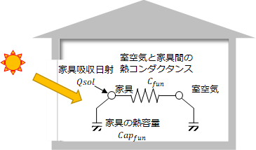

図1 備品等の伝熱計算モデル

室家具の熱収支は次式で表されるとする。

.. math::
    :nowrap:

    \begin{align*}
        C_{sh,frt} \cdot \frac{ d \theta_{frt} }{ dt } = G_{sh,frt} \cdot ( \theta_r - \theta_{frt} ) + Q_{sol}
        \tag{1}
    \end{align*}

------------------------------------------------------------------------------------------------------------------------
5 備品等の熱量量
------------------------------------------------------------------------------------------------------------------------

備品等の熱容量は入力値として指定することができるが、指定しない場合の規定値として、:math:`12.6` kJ / ( |m3| K ) が採用される。
ここに、その値の根拠を記す。

^^^^^^^^^^^^^^^^^^^^^^^^^^^^^^^^^^^^^^^^^^^^^^^^^^^^^^^^^^^^^^^^^^^^^^^^^^^^^^^^^^^^^^^^^^^^^^^^^^^^^^^^^^^^^^^^^^^^^^^^
5.1 積載荷重に関する調査
^^^^^^^^^^^^^^^^^^^^^^^^^^^^^^^^^^^^^^^^^^^^^^^^^^^^^^^^^^^^^^^^^^^^^^^^^^^^^^^^^^^^^^^^^^^^^^^^^^^^^^^^^^^^^^^^^^^^^^^^

住宅の積載荷重の観点から室内設置家具の容量を把握する。
建築基準法における住宅の積載荷重を次図に示す。
住宅の居室における床の構造計算に用いる積載荷重は、1,800 N / |m2| であり、これは約 180 kg / |m2| に相当する。
ここで定める積載荷重は、住宅の構造計算をする際に用いる設計値であることから、実際の持ち込み家具等に起因する荷重よりは大きく設定されていると推察される。

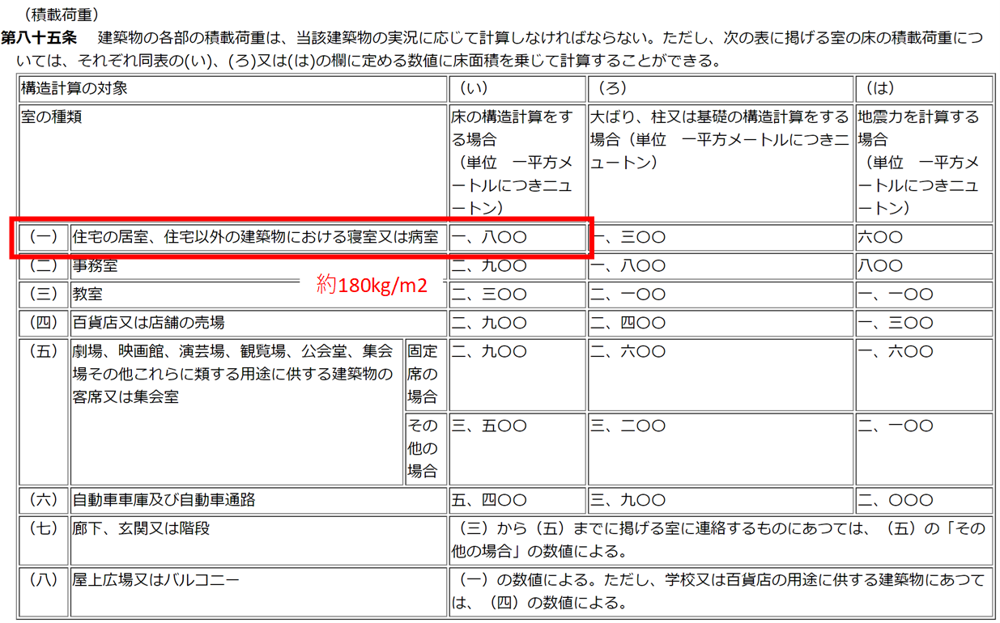

図2 建築基準法施行令 第85条 積載荷重

次図は、実際に居住している状態にある住宅居室における積載荷重の実態調査例\ :sup:`(1)` \である。
この例は特定の住戸4戸における調査結果であり、平均値は 43.8 kg / |m2| であり、建築基準法の積載荷重 180 kg / |m2| に対し 1 / 4 程度である。

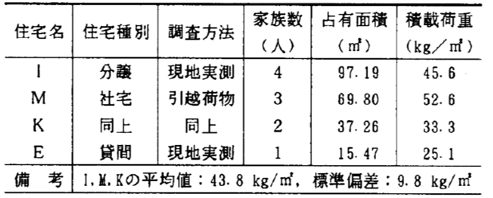

図3 集合住宅における積載荷重実測結果 \ :sup:`(1)` \

一方、次図は 100 戸に対する依頼型の調査（測定方法を記したマニュアルを配布し、居住者自らが実測、記入を行う）の結果\ :sup:`(2)` \である。
平均値は 33.8 kg / |m2| であり、20 ~ 40 kg / |m2| に 74 %、25 ～ 35 % に約半数が含まれる。

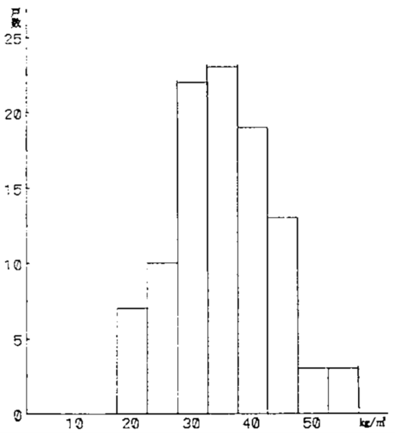

図4 単位面積当たりの平均物品重量の全戸数に対する分布（N=100） \ :sup:`(2)` \

次図は室種類別の平均重量で、洋室は 40 kg / |m2| 、和室は 25 kg / |m2| 、居室外は 20 kg / |m2| 程度である。

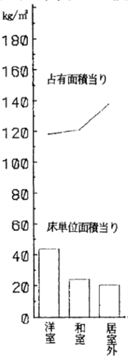

図5 室使用用途別平均物品重量の比較（N=100） \ :sup:`(2)` \

^^^^^^^^^^^^^^^^^^^^^^^^^^^^^^^^^^^^^^^^^^^^^^^^^^^^^^^^^^^^^^^^^^^^^^^^^^^^^^^^^^^^^^^^^^^^^^^^^^^^^^^^^^^^^^^^^^^^^^^^
5.2 火災荷重に関する基準
^^^^^^^^^^^^^^^^^^^^^^^^^^^^^^^^^^^^^^^^^^^^^^^^^^^^^^^^^^^^^^^^^^^^^^^^^^^^^^^^^^^^^^^^^^^^^^^^^^^^^^^^^^^^^^^^^^^^^^^^

家具等の家財に関する実態調査については、構造の観点からの積載荷重とは別に、耐火設計の観点からの火災荷重\ :sup:`(3)` \についても調査されている。
多くは事務所や商業施設に関する調査結果であるが、住宅についての調査結果もある。
火災荷重は、建築本体についての固定火災荷重と後々持ち込まれる積載火災荷重に分類される。

文献\ :sup:`(4)` \による住宅の積載火災荷重の調査結果を次図に示す。
調査対象件数は 100 件で、内戸建住宅が 87 件である。
調査年は 1987 年とやや古い。
戸建住宅は平均 33.9 kg / |m2|、集合住宅は平均 41.6 kg / |m2| である。
押し入れや台所、水まわりは比較的多く 70 ～ 80 kg / |m2|、リビングは 30 ～ 45 kg / |m2| 程度で、廊下は 10 kg / |m2| 程度と少ない。
椅子 1023 個についての火災荷重と表面積の関係を見るとほぼ比例関係がみられる。

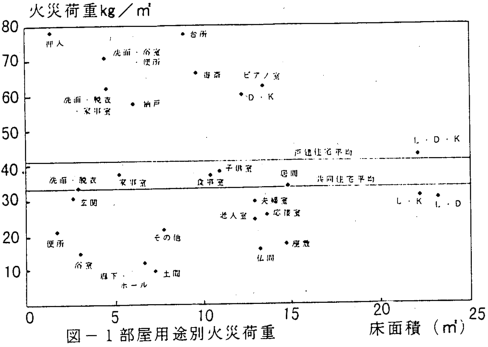

図6 文献\ :sup:`(4)` \による調査結果（部屋用途別火災荷重）

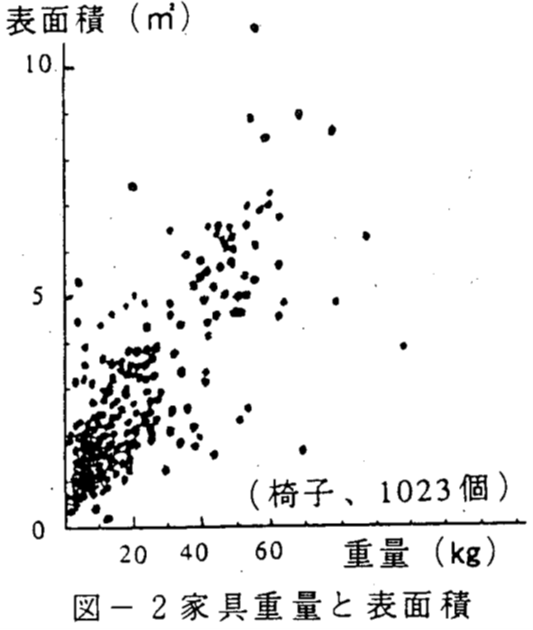

図7 文献\ :sup:`(4)` \による調査結果（家具重量と表面積）

^^^^^^^^^^^^^^^^^^^^^^^^^^^^^^^^^^^^^^^^^^^^^^^^^^^^^^^^^^^^^^^^^^^^^^^^^^^^^^^^^^^^^^^^^^^^^^^^^^^^^^^^^^^^^^^^^^^^^^^^
5.3	本プログラムにおける設定
^^^^^^^^^^^^^^^^^^^^^^^^^^^^^^^^^^^^^^^^^^^^^^^^^^^^^^^^^^^^^^^^^^^^^^^^^^^^^^^^^^^^^^^^^^^^^^^^^^^^^^^^^^^^^^^^^^^^^^^^

設置家具の熱容量をリビングで、30 ～ 45 kg / |m2| 程度とし、仮にそのすべてが木材（比熱：1.3 kJ / ( kg K ) ）、天井高さを 2.4 m と仮定すると、
室気積当たりの家具の熱容量は 16.3 ～ 24.4 kJ / ( |m3| K ) となる。
SMASHやAE-Sim/Heat における規定値は 12.6 kJ / ( |m3| K ) であり\ :sup:`(5)` \、近い値といえる。
本計算プログラムでは、暫定的に 12.6 kJ / ( |m3| K ) とする。

------------------------------------------------------------------------------------------------------------------------
6 備品等と空気間の熱コンダクタンス
------------------------------------------------------------------------------------------------------------------------

備品等と空気間の熱コンダクタンスは入力値として指定することができるが、指定しない場合の規定値として、
熱拡散率（熱コンダクタンスを備品等の熱容量で除した値） :math:`0.00022` 1 / s が採用される。
ここに、その値の根拠を記す。

住宅を対象とした家具の吸放熱の遅れに関する研究例はほとんどない。
非住宅建築物を対象とした研究例としては、石野らの調査\ :sup:`(6)` \がある。
実験から求めた室温二等辺三角波励振の吸熱応答を次図に示す。
住宅の場合は、事務所に比べて木材の割合が多く、事務所とは異なる吸熱応答になると考えられるが、ここではここに示した吸熱応答を再現するような熱コンダクタンスを同定することとした。

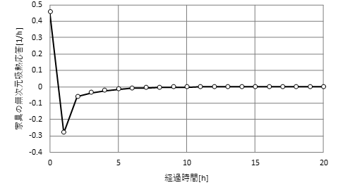

図8 既往文献\ :sup:`(6)` \における家具の吸熱応答

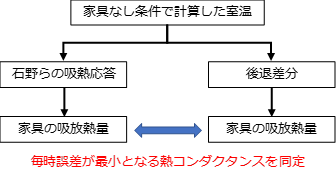

図9 熱コンダクタンスの同定方法

次表に示す計算条件において既往文献\ :sup:`(6)` \における吸熱応答を再現する熱拡散率を収束計算により求めた。

.. list-table:: 表3 熱拡散率を同定するための室温計算条件
    :header-rows: 1
    :widths: 1,1

    * - 項目
      - 設定した条件
    * - 建物モデル
      - 省エネ基準の標準プラン
    * - 断熱性能
      - 平成28年省エネ基準相当
    * - 地域
      - 拡張アメダス気象データ標準年（岡山）
    * - 各種スケジュール
      - 省エネ基準の条件に従う（空調は居室間歇空調）

吸熱応答を用いて計算した家具吸放熱量と、本節で示す後退差分で計算した家具吸放熱量を比較し、
毎時の絶対誤差の年積算が最小となる熱拡散率を収束計算により求めた結果、
求められた家具の熱拡散率は :math:`0.00022` 1 / s となった。
与えた室温と両者の毎時の吸放熱量を次図に示す。
暖房開始時にみられるような急激な励振の変化が生じた場合、その１時間後に乖離がみられる。
これは、後退差分が単純な熱容量集中系の計算モデルを採用しているのに対し、吸熱応答は各種複合材料で構成される実際の家具を対象に実験で求めたためである。
急激な励振の変化が生じない場合においては、十分な精度で推定できているのが確認できる。

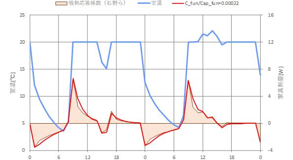

a 冬期代表日（12月30、31日）

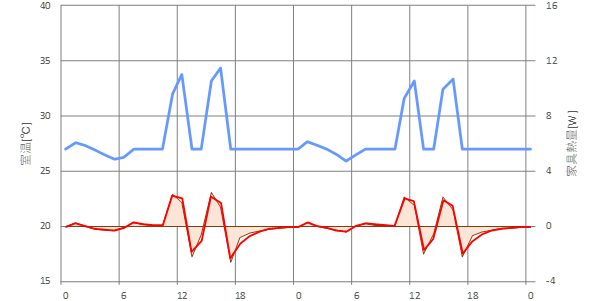

b 夏期代表日（8月2、3日）

図10 石野らの吸熱応答と後退差分で計算した家具の吸放熱量の時刻変動

石野らの吸熱応答係数と後退差分で求めた家具の吸放熱の比較を次図に示す。

一部両者で乖離する部分がみられるが、おおむねよく再現できているといえる。

.. image:: ../_static/images/04_12_basis_furniture_fig_11.png

図11 石野らの吸熱応答と後退差分で計算した家具の吸放熱量の比較

ここでは、暫定的に家具の熱拡散率を :math:`0.00022` 1 / s とすることとした。

------------------------------------------------------------------------------------------------------------------------
7 室温・顕熱負荷のケーススタディー
------------------------------------------------------------------------------------------------------------------------

前項で示した計算条件、家具の熱容量、熱コンダクタンスを設定して、室温・顕熱負荷の計算を実施した。
比較のため、家具の熱容量を無視した条件、家具の伝熱遅れのみを無視した条件（家具の熱容量を室空気の熱容量に加算した条件）も行った。
次図に冬期代表日の計算結果と年間熱負荷の比較を示す。
家具を無視した場合、家具の遅れを無視した場合は暖房開始時の熱負荷の相違だけであるが、家具の遅れを考慮する場合は暖房開始時だけでなく、暖房開始後 2 ～ 3 時間後の熱負荷も変化している。
年間熱負荷の比較をみると、特に年間暖房熱負荷での差異が大きいことが確認できる。

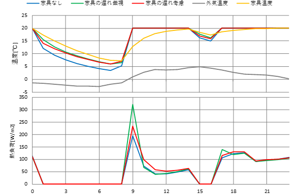

図12 家具のモデルによる室温、熱負荷の計算例（12月30日）

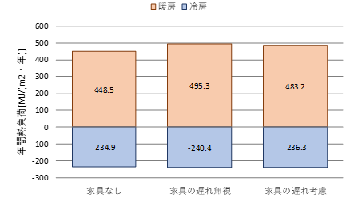

図13 家具のモデルによる年間熱負荷

------------------------------------------------------------------------------------------------------------------------
8 備品等の湿気容量と室空気間の湿気コンダクタンス
------------------------------------------------------------------------------------------------------------------------

^^^^^^^^^^^^^^^^^^^^^^^^^^^^^^^^^^^^^^^^^^^^^^^^^^^^^^^^^^^^^^^^^^^^^^^^^^^^^^^^^^^^^^^^^^^^^^^^^^^^^^^^^^^^^^^^^^^^^^^^
8.1 水分収支モデル
^^^^^^^^^^^^^^^^^^^^^^^^^^^^^^^^^^^^^^^^^^^^^^^^^^^^^^^^^^^^^^^^^^^^^^^^^^^^^^^^^^^^^^^^^^^^^^^^^^^^^^^^^^^^^^^^^^^^^^^^

備品等の水分収支式を次式で表すこととした。

.. math::
    :nowrap:

    \begin{align*}
        C_{lh,frt} \cdot \frac{ d X_{frt} }{ dt } = G_{lh,frt} \cdot ( X_r - X_{frt} )
        \tag{2}
    \end{align*}

.. image:: ../_static/images/04_12_basis_furniture_fig_14.png

図14 室湿度の計算モデル

^^^^^^^^^^^^^^^^^^^^^^^^^^^^^^^^^^^^^^^^^^^^^^^^^^^^^^^^^^^^^^^^^^^^^^^^^^^^^^^^^^^^^^^^^^^^^^^^^^^^^^^^^^^^^^^^^^^^^^^^
8.2 備品等の湿気容量
^^^^^^^^^^^^^^^^^^^^^^^^^^^^^^^^^^^^^^^^^^^^^^^^^^^^^^^^^^^^^^^^^^^^^^^^^^^^^^^^^^^^^^^^^^^^^^^^^^^^^^^^^^^^^^^^^^^^^^^^

備品等の潜熱容量は文献 :sup:`(5)` をもとに、41.9 kJ / ( |m3| g / kg(DA) )  （ 16.8 kg / ( |m3| kg / kg(DA) ) ）とする。

^^^^^^^^^^^^^^^^^^^^^^^^^^^^^^^^^^^^^^^^^^^^^^^^^^^^^^^^^^^^^^^^^^^^^^^^^^^^^^^^^^^^^^^^^^^^^^^^^^^^^^^^^^^^^^^^^^^^^^^^
8.3 室空気と備品間の湿気コンダクタンス
^^^^^^^^^^^^^^^^^^^^^^^^^^^^^^^^^^^^^^^^^^^^^^^^^^^^^^^^^^^^^^^^^^^^^^^^^^^^^^^^^^^^^^^^^^^^^^^^^^^^^^^^^^^^^^^^^^^^^^^^

住宅を対象とした備品等の湿気コンダクタンスの調査例はほとんど見当たらない。
ここでは、熱コンダクタンスと同様に、New HASP/ACLDで採用されている家具類潜熱の吸放湿の遅れを再現するような湿気コンダクタンスを決定する。
室湿度のステップ入力に対する吸湿単位応答は次式で定められている。

.. math::
    :nowrap:

    \begin{align*}
        \phi_A (t) = 2 \cdot \exp^{-2 \cdot \frac{t}{3600}}
        \tag{3}
    \end{align*}

二等辺三角形の吸熱応答は次式となる。

.. math::
    :nowrap:

    \begin{align*}
        \phi_A (t) = 1 - \exp^{-2 \cdot \frac{t}{3600}}
        \tag{3}
    \end{align*}

これを図示すると次図のようになる。

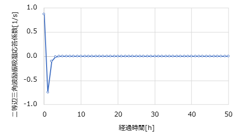

図15 二等辺三角波励振の吸熱応答

この吸熱応答を再現するように湿気コンダクタンスを求めたところ、湿気容量との関係は次式となった。

.. math::
    :nowrap:

    \begin{align*}
        G_{lh,frt,i} = 0.0018 \cdot C_{lh,frt,i}
        \tag{4}
    \end{align*}

------------------------------------------------------------------------------------------------------------------------
9 等価日射の吸収割合
------------------------------------------------------------------------------------------------------------------------

^^^^^^^^^^^^^^^^^^^^^^^^^^^^^^^^^^^^^^^^^^^^^^^^^^^^^^^^^^^^^^^^^^^^^^^^^^^^^^^^^^^^^^^^^^^^^^^^^^^^^^^^^^^^^^^^^^^^^^^^
9.1 はじめに
^^^^^^^^^^^^^^^^^^^^^^^^^^^^^^^^^^^^^^^^^^^^^^^^^^^^^^^^^^^^^^^^^^^^^^^^^^^^^^^^^^^^^^^^^^^^^^^^^^^^^^^^^^^^^^^^^^^^^^^^

開口部からの透過日射熱取得は、直接、室負荷（室空気の加熱）となるのではなく、一旦、室内表面で吸収されたのちに対流熱伝達によって室負荷となる。
ここでは、透過日射熱取得の室内表面での吸収比率による室内環境や熱負荷への影響を確認し、今後の透過日射の室内表面吸収比率検討の参考とする。

なお、ここでは、透過日射量は50%が家具に吸収され、残りの50%が床に吸収されるのが妥当であると結論づけているが、本計算方法では、透過日射量のうち家具に吸収される割合を指定することが可能である。
指定しなかった場合は規定値として0.5（50%）が設定される。
また、家具に吸収されなかった50%については、床・壁・天井等の境界で吸収される。
家具に吸収されなかった日射量が境界に吸収されるか否かについてを境界ごとに設定することが可能である。
複数の部位で吸収される設定をした場合は、その境界の面積に応じて日射量が按分される。

^^^^^^^^^^^^^^^^^^^^^^^^^^^^^^^^^^^^^^^^^^^^^^^^^^^^^^^^^^^^^^^^^^^^^^^^^^^^^^^^^^^^^^^^^^^^^^^^^^^^^^^^^^^^^^^^^^^^^^^^
9.2 代表的なプログラムでの扱い
^^^^^^^^^^^^^^^^^^^^^^^^^^^^^^^^^^^^^^^^^^^^^^^^^^^^^^^^^^^^^^^^^^^^^^^^^^^^^^^^^^^^^^^^^^^^^^^^^^^^^^^^^^^^^^^^^^^^^^^^

次表に代表的なプログラムにおける窓の透過日射の吸収部位の比率を示す。

.. list-table:: 表4 代表的なシミュレーションプログラムにおける透過日射の吸収部位
    :header-rows: 1
    :widths: 1,3

    * - SMASH
      - 床に50%、残りは床と窓以外に面積案分
    * - Sim/Heat
      - 床に50%、残りは床を含んだすべての部位に面積案分
    * - BEST-H
      - すべて家具で吸収。ただし、家具が未設置の室については床で吸収する
    * - EESLISM
      - 床に30%、残りは床を含んだすべての部位に面積案分
    * - THERB
      - 1次入射の部位を計算し、多重反射による部位ごとの日射吸収比率を解く

THERBは太陽位置から1次入射する部位を求め、多重反射を考慮して最終的な吸収部位を決定する。
それ以外は特定の部位に対し多めに吸収させるといった方法が採用されている。
BEST-Hでは、すべて家具で吸収するモデルを採用している。

^^^^^^^^^^^^^^^^^^^^^^^^^^^^^^^^^^^^^^^^^^^^^^^^^^^^^^^^^^^^^^^^^^^^^^^^^^^^^^^^^^^^^^^^^^^^^^^^^^^^^^^^^^^^^^^^^^^^^^^^
9.3 透過日射の吸収比率に関する感度解析
^^^^^^^^^^^^^^^^^^^^^^^^^^^^^^^^^^^^^^^^^^^^^^^^^^^^^^^^^^^^^^^^^^^^^^^^^^^^^^^^^^^^^^^^^^^^^^^^^^^^^^^^^^^^^^^^^^^^^^^^

透過日射の部位での吸収比率が室内温熱環境や熱負荷に与える影響を確認する。
用いたモデルを次図に示す。

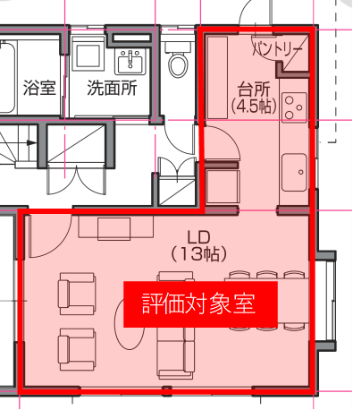

図16 用いたモデル（自立循環型モデル住宅のLDK）

その他の設定は次のとおりである。

* 気象データ：拡張アメダス気象データ1995標準年（岡山）
* 床面日射吸収比率：50% / 100%
* 断熱性能：断熱なし / H28年省エネ基準
* 床蓄熱RC：RCあり（150mm） / RCなし（0mm）

次図に床面の日射吸収比率を種々に変更した時の室内温熱環境と熱負荷を示す。
断熱性能が高く、床の熱容量が大きい条件のときにやや相違がみられるが、それ以外の条件では吸収比率の設定値による影響はほとんど見られない。

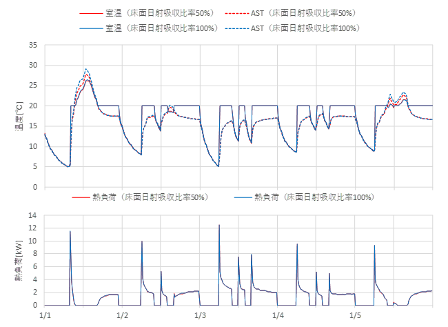

図17(a) 計算結果（H28省エネ基準・RCなし） :sup:`(7)` 

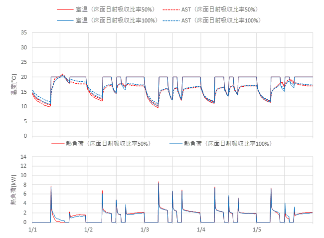

図17(b) 計算結果（H28省エネ基準・RCあり） :sup:`(7)`

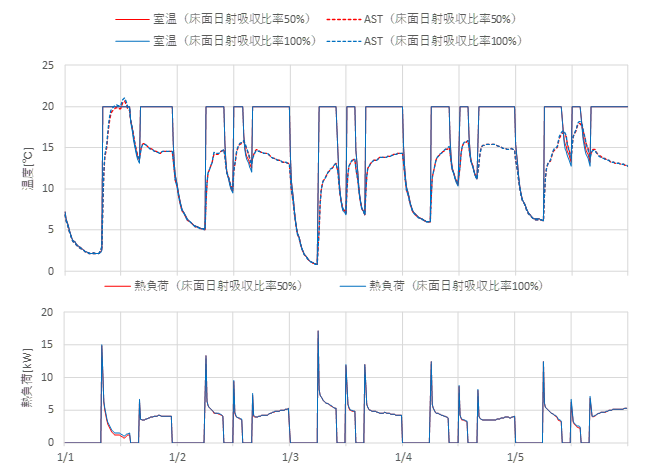

図17(c) 計算結果（断熱なし・RCなし） :sup:`(7)`

.. image:: ../_static/images/04_12_basis_furniture_fig_17d.png

図17(e) 計算結果（断熱なし・RCあり） :sup:`(7)`

.. image:: ../_static/images/04_12_basis_furniture_fig_17e.png

図17(e) 計算結果（H28省エネ基準・RCあり） :sup:`(7)`

年間熱負荷の比較を次図に示す。
透過日射の室内部位への吸収比率の設定が年間熱負荷に与える影響は限定的である。
絶対値での差は断熱性能が悪いほうが大きくなる傾向にある。
また、南向きを想定したため冷房よりも暖房の差の方が大きい。

.. image:: ../_static/images/04_12_basis_furniture_fig_18.png

図18 計算結果（年間熱負荷）（図中FsolFlrは透過日射の床面の吸収比率を表す）

ここで設定した条件の範囲内における透過日射の室内部位への吸収比率を変化させたときの計算結果への影響はわずかであった。
1次エネルギー計算時には3次元的な位置関係を入力するわけではない。
計算結果への影響度合い、得られる情報が限定的（3次元情報は得られない）なことから、ここでは、規定値として、透過日射の吸収は床と家具で半々にする方法を提案する。

------------------------------------------------------------------------------------------------------------------------
10 注
------------------------------------------------------------------------------------------------------------------------

1. 遠藤薫、伊藤正義、井野智、杉野目章：集合住宅における積載荷重調査、日本建築学会大会学術講演梗概集。pp. 205-206、1992.8
2. 石川孝重、田中美知：住宅の積載荷重に関する研究 その１ 100住戸に対する調査、日本建築学会大会学術講演梗概集、pp. 1395-1396、1987.10
3. 火災荷重は「材質の異なる火災を比較する場合に用い、可燃物の量を同じ発熱量を持つ木材の量に換算したものの単位面積当たりの数値で表わす。」と定義されている。
4. 佐藤博臣、栗岡均、泉潤一、須川修身、石川孝重：木造住宅の火災荷重に関する分析 その1 積載火災荷重について、日本建築学会大会学術講演梗概集、pp. 31-32、1997.9
5. 「住宅性能評価機関等連絡協議会(2004)ベンチマークテストの結果による温熱環境（年間暖冷房負荷計算方法）に関する試験ガイドライン」
6. 石野久彌、郡公子：事務所建築における家具類の熱的影響に関する実測・実験研究、日本建築学会計画系論文報告集 第372号、pp. 59-66、1987.2
7. AST：面積加重平均表面温度（Average Surface Temperature）
